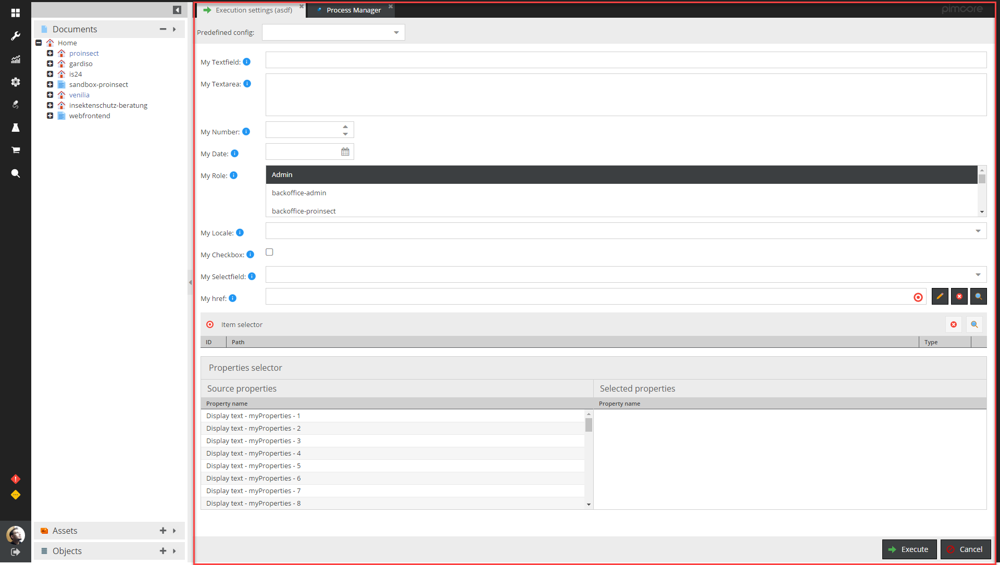

### How to use

**In short:** 
The [SampleCommand](/src/Elements/Bundle/ProcessManagerBundle/examples/ProcessManager/Command/SampleCommand.php) is a example 
how you should use the plugin. If you are new to this Bundle just copy this file to your projekt command space (alter namespaces) 
and set up the command in the processmanager.

Details: When a script is executed via the Pimcore admin interface a monitoring item is created and the id of the monitoring item is passed to the cli script (Param: monitoring-item-id).
You will have to retrieve this id in your script and call the initProcessManager() function of the \Elements\Bundle\ProcessManagerBundle\ExecutionTrait. 

In your script you update the status of the monitoring item. The information of the monitoring item is used to display the status...
in the pimcore admin.

## Callbacks

Callbacks are configuration windows/forms which are displayed before a process is executed. This allowes the user to configure certain runitme options. 
The selected values are stored in the monitoring item and can be retrieved by calling 

```php
$callbackSettings = $monitoringItem->getCallbackSettings();
```

A "Callback" can be defined on each process  ("Settings" -> "Callback"). To create a new custom callback you have to add an entry to the "executorCallbackClasses" array in the config. 
A entry could look like this:

```php
[
            "name" => "exportProducts",
            "class" => "\\Elements\\Bundle\\ProcessManagerBundle\\Executor\\Callback\\General",
            "extJsClass" => "pimcore.plugin.PLUGINNAME.processmanager.executor.callback.exportProducts",
]
```

For most use cases you just have to provide a unique "name" and a extJsClass which is responsible to open the window.
The ExtJs Class sould extend the pimcore.plugin.processmanager.executor.callback.abstractCallback and implement a "getFormItems" method which returns the configuration fields.

The abstract callback Class implements certain helpers to easily add new form elements. Please take a look at [example.js](/src/Elements/Bundle/ProcessManagerBundle/Resources/public/js/executor/callback/example.js). This class demonstrates how to add the provided fields. Of course you can add your own custom fields as well.

The example.js file provides a callback window like this:



## Rest-API

The Process Manager also provides a rest service to start jobs...
If you want to use the Rest Service you have to define the Pimcore users which should be allowed to execute/list... jobs in the "plugin-process-manager.php" config file.
Therefore add an array "restApiUsers" to the config as shown in the example below
```php
return [
    "general" => [
        "archive_treshold_logs" => 7,
        "executeWithMaintenance" => false,
        "processTimeoutMinutes" => 30
    ],
    "restApiUsers" => [
        [
            "username" => "ckogler",
            'apiKey' => "secret"
        ]
    ],

...
]

```
 You have to pass the "username" and "apiKey" parameter on each request. 

**URL: http://YOUR-DOMAIN/webservice/elementsprocessmanager/rest/execute?username=ckogler&apiKey=secret**
 
Executes a job by an ID or by the name. 

| Parameter | Type | Description |
| ----- | ------| ----------- |
| "id" or "name" | mandatory | ID or name of the configuration to execute |
| "callbackSettings" | optional | A Json or Xml string which is stored as the callbackSettings in the monitoring item |

It returns the monitoring item ID to check the process state...
**Example:**
```json
{
  "success": true,
  "monitoringItemId": 123
}
```

**URL: http://YOUR-DOMAIN/webservice/elementsprocessmanager/monitoring-item-state?username=ckogler&apiKey=secret**
 
Returns the state of a process by the monitoring item id

| Parameter | Type | Description |
| ----- | ------| ----------- |
| "id"| mandatory | ID of the monitoring item |

It returns the monitoring item ...
